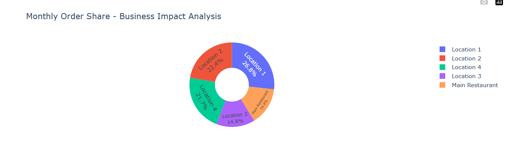

# 🍕 Restaurant Orders Analysis: Monthly Performance

This project provides a data-driven visualization of delivery order fluctuations across five different locations. It highlights how external events—like health inspections and facility expansions—impact the business's market share.

## 📊 The Business Scenario
The analysis covers a specific month with the following operational changes:
* **Main Restaurant**: Orders dropped by **50%** due to a 2-week closure for a health inspection.
* **Location 2**: Orders increased by **30%** following a successful dining room expansion and menu update.
* **Location 3**: Saw a steady **3% growth** in demand.
* **Locations 1 & 4**: Remained stable, maintaining their previous performance (18,650 and 15,100 orders).

## 🛠️ Tech Stack
* **Python**: Core language for data processing.
* **Pandas**: Used for structuring and calculating the updated order volumes.
* **Plotly Express**: Used to create a modern, interactive **Donut Chart** for clear data interpretation.

## 📈 Key Visualization: Donut Chart
The chart below illustrates the "order share" of each unit. By using a donut chart with internal labels, the visualization remains clean and professional, allowing for immediate comparison between the locations.

## 💡 Insights
The visualization clearly shows that while the **Main Restaurant** lost significant ground, the expansion of **Location 2** helped mitigate the overall impact on the network. This demonstrates the importance of location diversification in the food industry.
